<h1 align="center">🎓 CAMP</h1>

<h3 align="center">
College Attendance Management Portal
</h3>

<p align="center">
A modern ERP-inspired web application for managing students, teachers, and attendance with future AI-powered automation.
</p>

<p align="center">


</p>

A modern **ERP-inspired College Attendance Management Portal (CAMP)** built using **Node.js**, **Express.js**, **SQLite**, and **Bootstrap**. The system is designed to simplify academic administration by managing students, teachers, attendance, and institutional data through a centralized web interface.

The long-term vision of CAMP is to evolve into a complete campus ERP with **AI-powered Face Recognition Attendance**, **QR Verification**, **Reporting**, and **Analytics** while maintaining a scalable and modular architecture.

## 🌟 Why CAMP?

Managing academic data manually can be time-consuming and error-prone. CAMP is designed to provide a centralized and scalable solution for educational institutions by combining modern web technologies with future AI-powered attendance automation.

The project follows a modular ERP architecture, allowing new modules to be integrated seamlessly as development progresses.

---

## 📑 Table of Contents

- [✨ Features](#-features)
- [🛠️ Technology Stack](#️-technology-stack)
- [📂 Project Structure](#-project-structure)
- [🚀 Installation](#-installation)
- [📦 Current Modules](#-current-modules)
- [📸 Screenshots](#-screenshots)
- [📚 Documentation](#-documentation)
- [📈 Sprint Progress](#-sprint-progress)
- [🗺️ Future Roadmap](#️-future-roadmap)
- [📌 Project Status](#-project-status)
- [👨‍💻 Maintainer](#-maintainer)


## ✨ Features

### 🔐 Authentication
- Secure Admin Login
- Session Management

### 📊 Dashboard
- Overview of system statistics
- Quick navigation to modules
- Responsive dashboard layout

### 👨‍🎓 Student Management
- Register Students
- View Student Details
- Edit Student Information
- Delete Student Records
- Live Search

### 👨‍🏫 Teacher Management
- Register Teachers
- View Teacher Details
- Edit Teacher Information
- Delete Teacher Records
- Live Search

### 🏗️ Upcoming Modules
- Subject Management
- Class & Section Management
- Attendance Management
- Face Recognition Attendance
- QR Verification
- Reports & Analytics

## 🛠️ Technology Stack

| Category | Technology |
|----------|------------|
| **Backend** | Node.js & Express.js |
| **Frontend** | HTML5, CSS3, JavaScript |
| **UI Framework** | Bootstrap 5 |
| **Database** | SQLite (better-sqlite3) |
| **Programming Language** | JavaScript (Node.js) |
| **Template Engine** | EJS (Embedded JavaScript) |
| **Version Control** | Git & GitHub |
| **Development Environment** | Visual Studio Code |

### 🚀 Future Integrations

**AI & Computer Vision**
- OpenCV
- InsightFace

**Data Processing**
- NumPy
- Pandas

**Visualization**
- Chart.js

**Attendance**
- QR Code Verification

## 📂 Project Structure

```text
CAMP/
│
├── database/
│   ├── init_db.js
│   └── database.db
│
├── src/
│   ├── routes/
│   ├── services/
│   └── middleware/
│
├── views/
│   ├── auth/
│   ├── components/
│   ├── dashboard/
│   ├── student/
│   ├── student_portal/
│   ├── teacher/
│   ├── teacher_portal/
│   ├── attendance/
│   ├── qr/
│   └── reports/
│
├── public/
│   ├── css/
│   ├── js/
│   └── images/
│
├── docs/
│   └── README_IMAGES/
│
├── server.js
├── package.json
└── README.md
```

## 🚀 Installation

### 1. Clone the Repository

```bash
git clone https://github.com/pixelsaurabh/CAMP.git
```

### 2. Navigate to the Project Folder

```bash
cd CAMP
```

### 3. Install Dependencies

```bash
npm install
```

### 4. Run the Application

```bash
npm start
```

*(Or run directly with `node server.js`)*

The application will be available at:

```
http://127.0.0.1:5000
```

## 📦 Current Modules

### ✅ Authentication
- Admin Login
- Session Handling

### ✅ Dashboard
- System Statistics
- Quick Navigation

### ✅ Student Management
- Register Student
- Student Listing
- Live Search
- View Details
- Edit Information
- Delete Student

### ✅ Teacher Management
- Register Teacher
- Teacher Listing
- Live Search
- View Details
- Edit Information
- Delete Teacher

## 🎯 Project Objectives

- Simplify student and teacher management.
- Provide a centralized academic administration system.
- Build a scalable ERP architecture for educational institutions.
- Integrate AI-powered attendance using face recognition.
- Enhance campus management through automation.

## 📸 Screenshots

> Screenshots will be updated after each major sprint.

### Dashboard

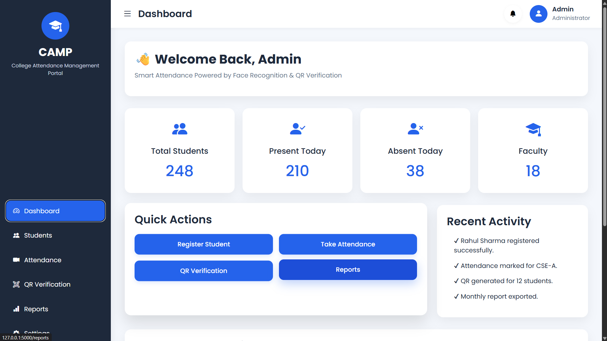

---

### Student Management

| Student List | Register Student |
|---------------|------------------|
| 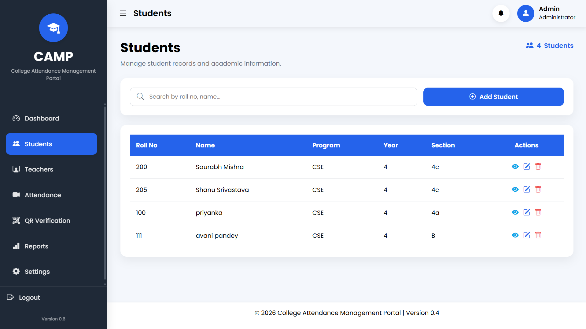 | 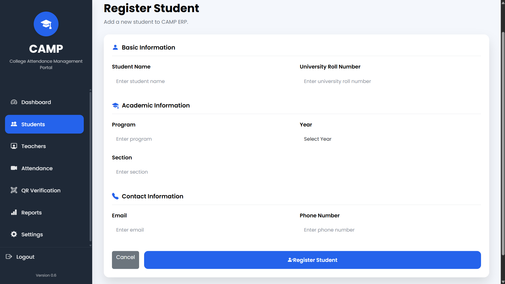 |

| View Student | Edit Student |
|--------------|--------------|
| 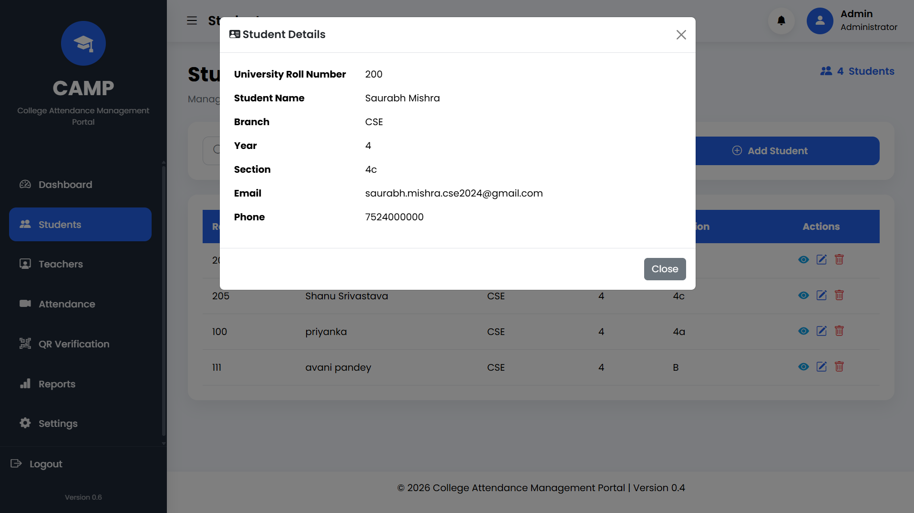 | 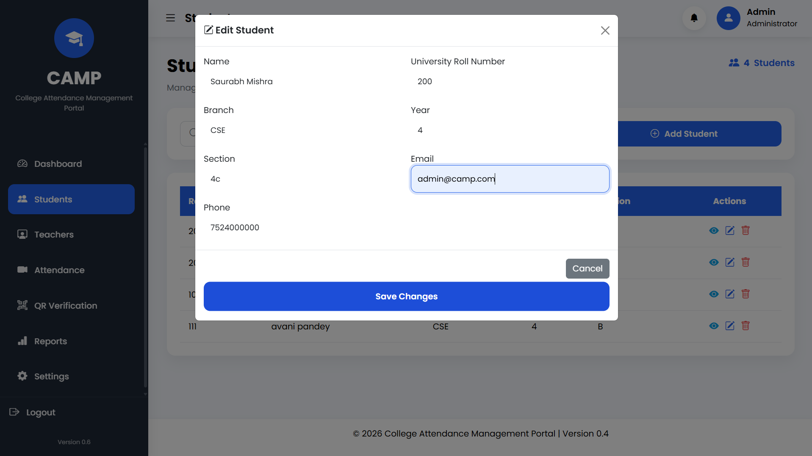 |

| Delete Student | Search Student |
|----------------|----------------|
| 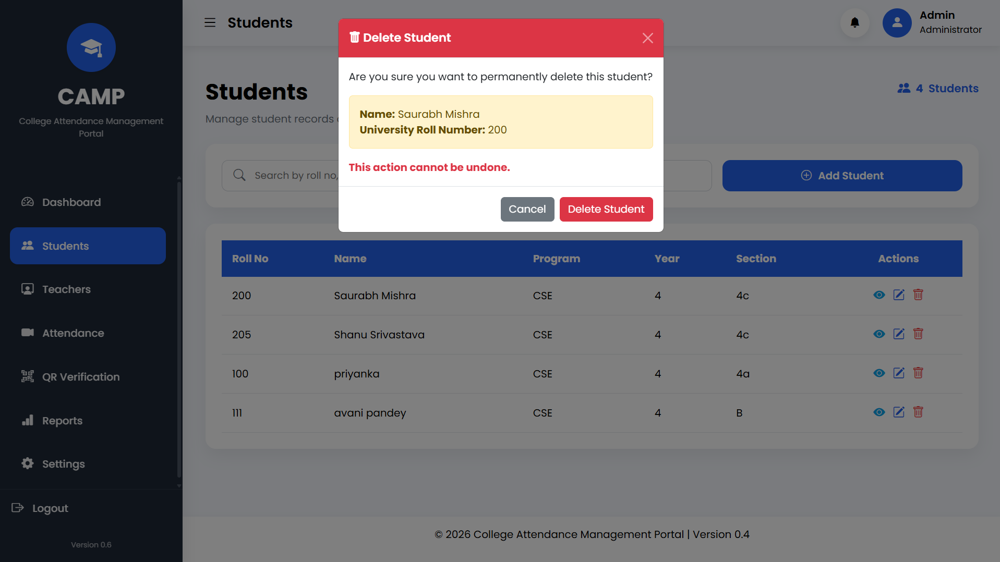 |  |

---

### Teacher Management

| Teacher List | Register Teacher |
|---------------|------------------|
| 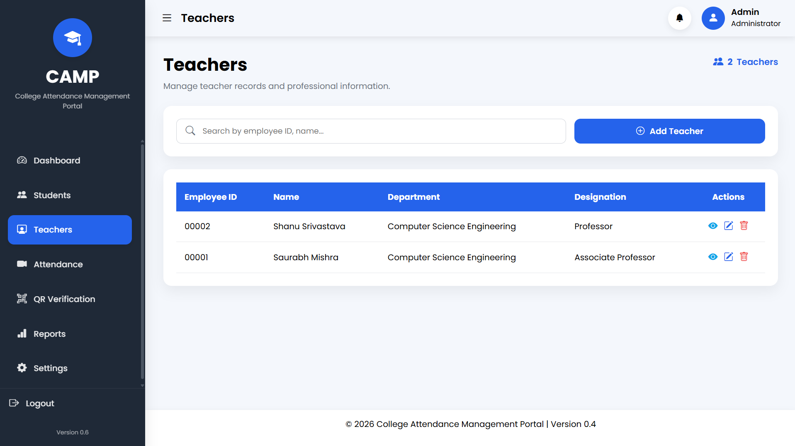 | 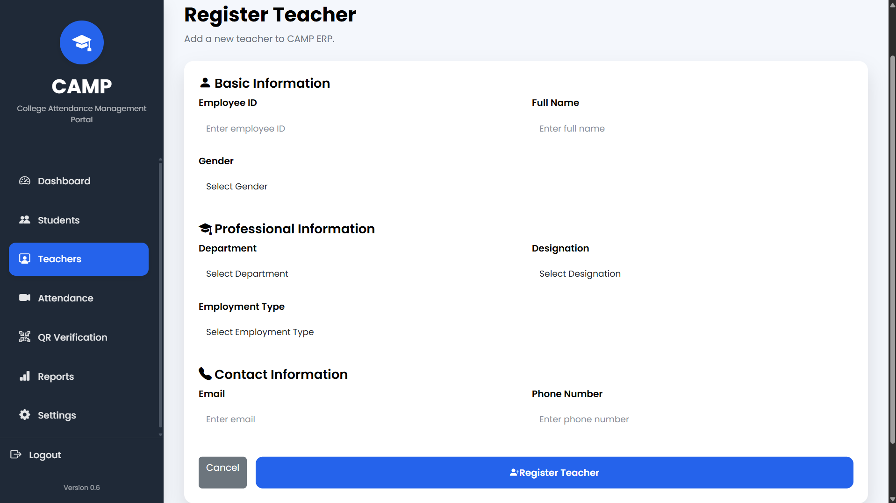 |

| View Teacher | Edit Teacher |
|--------------|--------------|
| 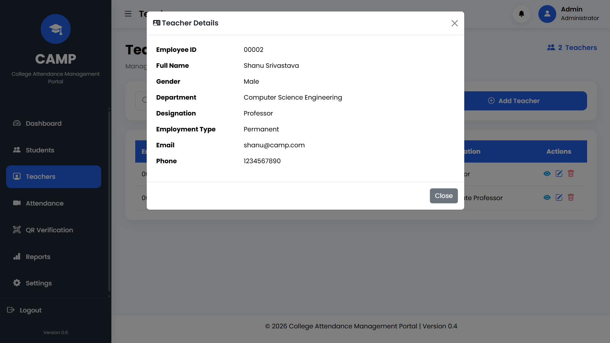 | 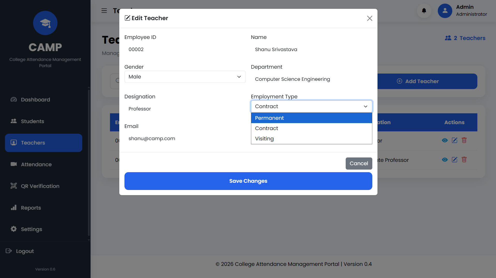 |

| Delete Teacher | Search Teacher |
|----------------|----------------|
| 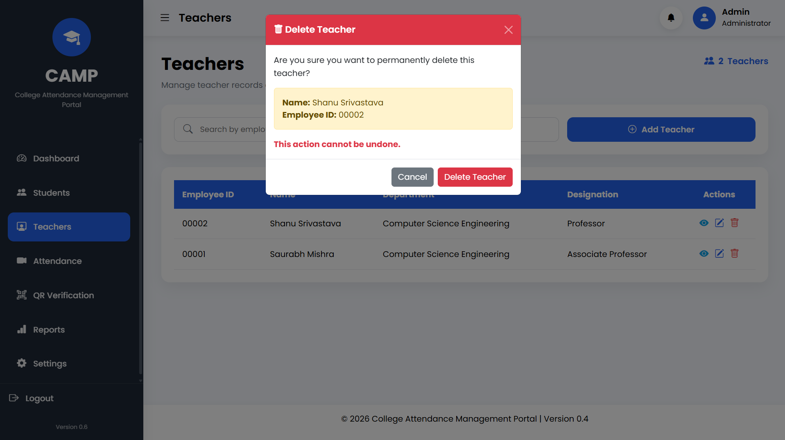 |  |


## 📚 Documentation

Detailed project documentation is available in the `docs` directory, including sprint reports, release notes, architecture, and the future development roadmap.

| Document | Description |
|----------|-------------|
| `Architecture.md` | Overall project architecture and design decisions |
| `FutureRoadmap.md` | Planned features and future development |
| `Sprint1.md` | Sprint 1 progress |
| `Sprint2.md` | Sprint 2 progress |
| `Sprint3.md` | Sprint 3 progress |
| `Sprint4.md` | Sprint 4 progress |
| `Sprint5.md` | Sprint 5 progress |
| `Sprint6.md` | Sprint 6 progress |
| `Release-v0.4.md` | Version 0.4 release notes |
| `Release-v0.5.md` | Version 0.5 release notes |
| `Release-v0.6.md` | Version 0.6 release notes |

## 📈 Sprint Progress

| Sprint | Status | Highlights |
|---------|--------|------------|
| Sprint 1 | ✅ Completed | Authentication & Dashboard |
| Sprint 2 | ✅ Completed | Student Registration |
| Sprint 3 | ✅ Completed | Student Management |
| Sprint 4 | ✅ Completed | UI Improvements & Responsiveness |
| Sprint 5 | ✅ Completed | Teacher Registration |
| Sprint 6 | ✅ Completed | Complete Teacher Management CRUD |

---

### Current Version

**v0.6**

## 🗺️ Future Roadmap

### Version 0.7
- Subject Management
- Department Management
- Class & Section Management

### Version 0.8
- Timetable Management
- Teacher Subject Allocation
- Attendance Logic

### Version 0.9

- AI Face Recognition Attendance
- QR-based Attendance Verification
- Attendance Analytics Dashboard

### Version 1.0

- Complete College ERP Platform
- Reports & Export (PDF/Excel)
- Notifications
- AI-powered Attendance Automation

## 📌 Project Status

CAMP is currently under active development following a sprint-based development approach.

Current Stable Version: **v0.6**

Completed:
- Authentication
- Dashboard
- Student Management
- Teacher Management

Upcoming:
- Subject Management
- Attendance Module
- AI Face Recognition

## 👨‍💻 Maintainer

Saurabh Mishra

B.Tech Computer Science Engineering

GitHub: https://github.com/pixelsaurabh

LinkedIn: https://www.linkedin.com/in/pixelsaurabh575

---

⭐ If you found this project interesting, consider giving it a star on GitHub.

